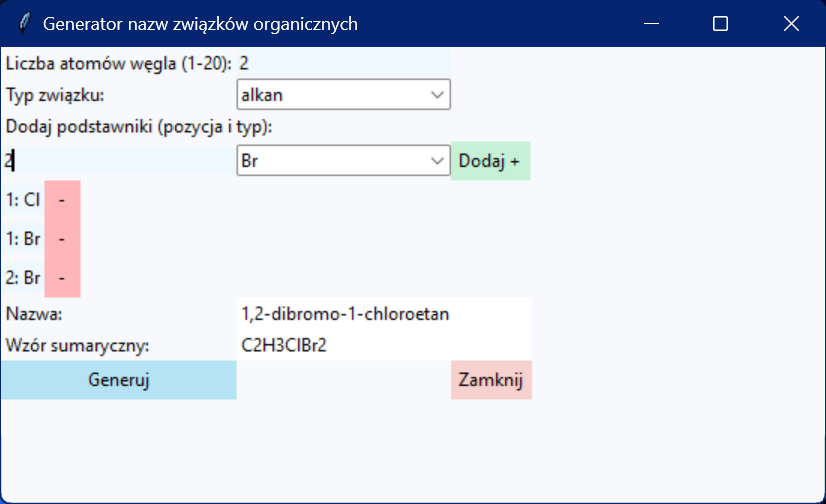

# Organic Compounds Name Generator
###### <i>Note: App itself and generated name are in Polish only, but I'm open to any contributors who want to help in translation<i>



## About
This is a simple name generator for organic compounds based on [IUPAC](https://iupac.org) rules.

## Available compounds type:
- alkanes
- alkenes
- alkynes

## How to build?
If you don't want to download ``` .exe ``` file available in "Release" page, you can build it yourself.
### Step-by-step guide
- clone this repo
```bash
git clone https://github.com/MATIKO100YT/organic-compounds-name-generator.git
```
- go to repo
```bash
cd organic-compounds-name-generator
```
- install [Pyinstaller](https://github.com/pyinstaller/pyinstaller) via repo or by ``` pip install pyinstaller ```
- run ``` pyinstaller --name "Generator nazw związków organicznych" --noconsole --onefile organicNameGeneratorGUI.py ```
- you can find generated ``` .exe ``` in ``` dist/ ```

## Additional resources
- [Pyinstaller](https://pyinstaller.org/en/stable/) doc

## License

This project is available under the MIT license - see [LICENSE](LICENSE) for details.

Copyright (c) 2025 Mateusz Celiński
