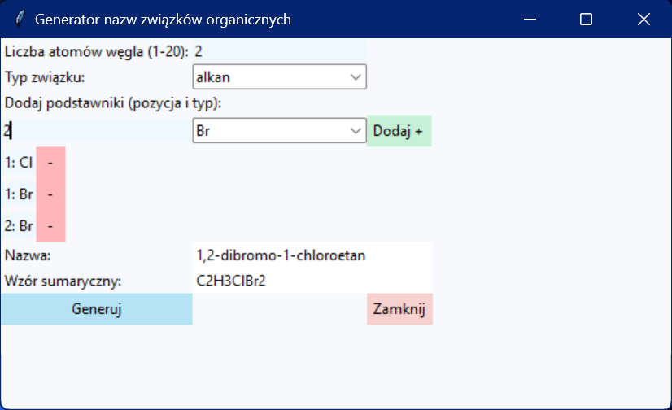

# Generator nazw związków organicznych
###### <i>Note: for Polish speakers only<i>



Jest to prosty generator nazw związków organicznych zgodny z zasadami IUPAC (Międzynarodowej Unii Chemii Czystej i Stosowanej).

## Obsługiwane typy związków to:
- alkany
- alkeny
- alkiny

## Jak zbudować?
Jeśli nie chcesz korzystać z gotowego pliku .exe, możesz sam zbudować cały projekt.
### Krok po kroku jak to zrobić
- sklonuj całe repo
```bash
git clone https://github.com/MATIKO100YT/organic-compound-name-generator.git
```
- przejdź do repo
```bash
cd organic-compound-name-generator
```
- zainstaluj [Pyinstallera](https://github.com/pyinstaller/pyinstaller) z repo lub przez ``` pip install pyinstaller ```
- wywołaj ``` pyinstaller --name "Generator nazw związków organicznych" --noconsole --onefile organicNameGeneratorGUI.py ```
- wygenerowany ``` .exe ``` znajdziesz w ``` dist/ ```

## Dodatkowe zasoby
- dokumentacja [Pyinstallera](https://pyinstaller.org/en/stable/)

## Licencja

Ten projekt jest dostępny na mocy licencji MIT - zobacz plik [LICENSE](LICENSE) po szczegóły.

Copyright (c) 2025 Mateusz Celiński
